## 软件简介

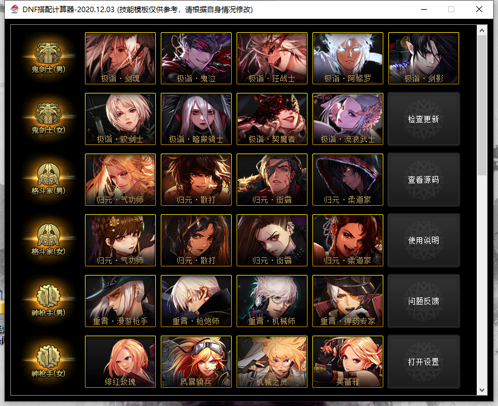

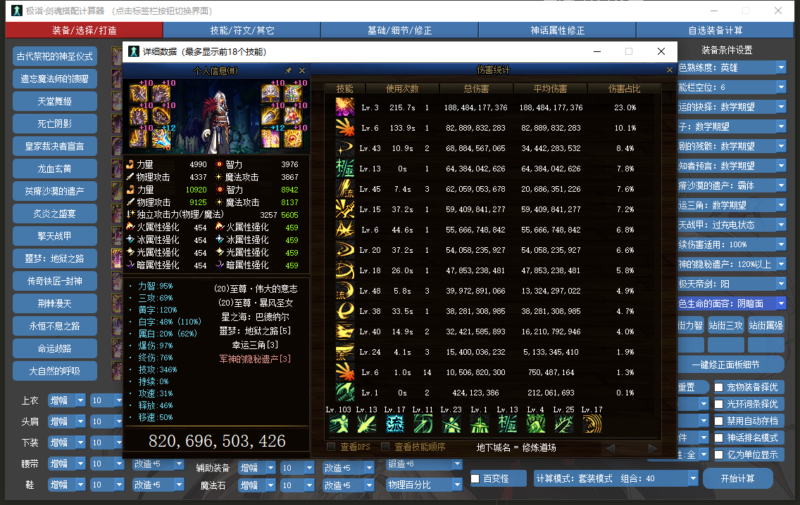

本软件为 DNF 相关的计算器，供玩家进行搭配装备及伤害计算等各方面使用 
主体功能包含：装备择优、打桩伤害计算、光环|宠物装备|希洛克词条择优、辟邪玉计算、切装计算等 
目前计算器已涵盖所有的职业，同时对韩服特有的部分职业平衡进行了前瞻性更新 

## 开始使用

<strong>下载路径</strong>: https://wwx.lanzous.com/b01bfj76f 或 https://pan.lanzou.com/b01bfj76f 
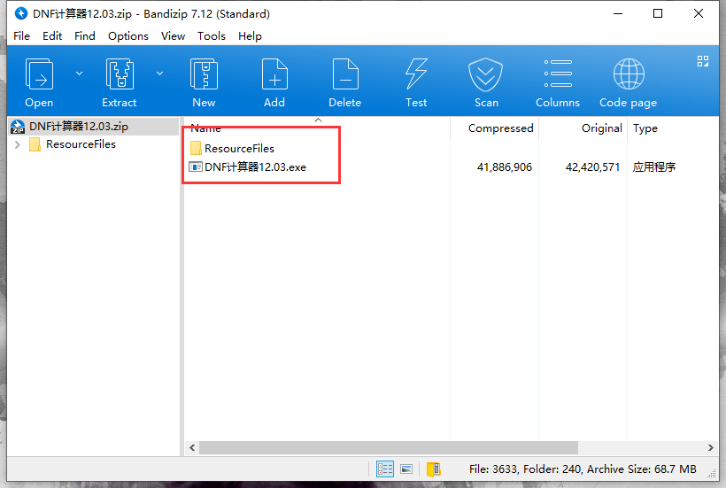

下载网盘中最新程序`DNF计算器XX.XX.zip`并完整解压，ResourceFiles 为资源文件，包含贴图及配置文件 
更新时仅需将压缩包完整解压出来并且覆盖(提示时点击替换)旧版文件即可，旧版设置的配置文件会被保留 

## 合规性校验

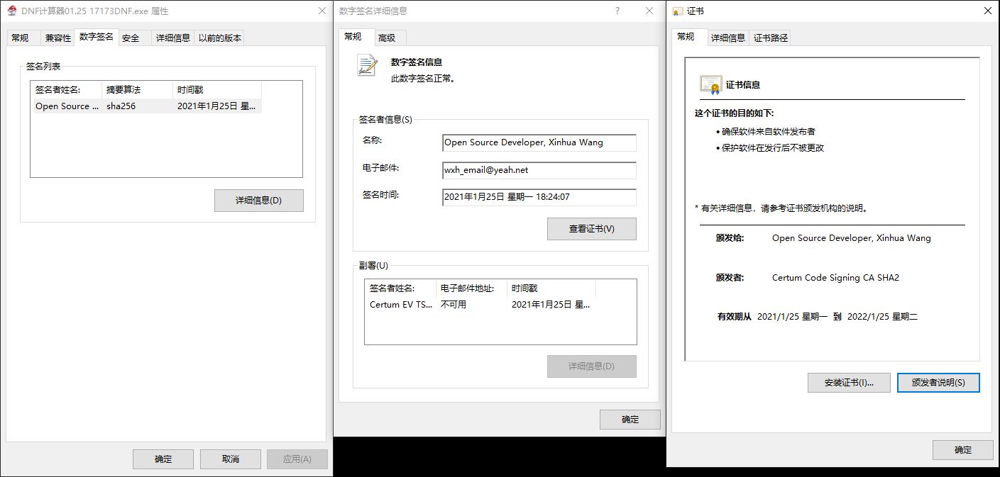

正规途径下载的计算器，右键 exe 程序的属性，可在数字签名中查看到第三方机构认证颁发的代码签名 

!> 使用前请确保数字签名存在且与说明书中一致 如无数字签名，则程序可能为第三方修改后的打包版本，请谨慎使用 

### 常见问题

- 蓝奏云无法打开 
  修改 DNS 服务器地址，首选 114.114.114.114，备用 8.8.8.8 
  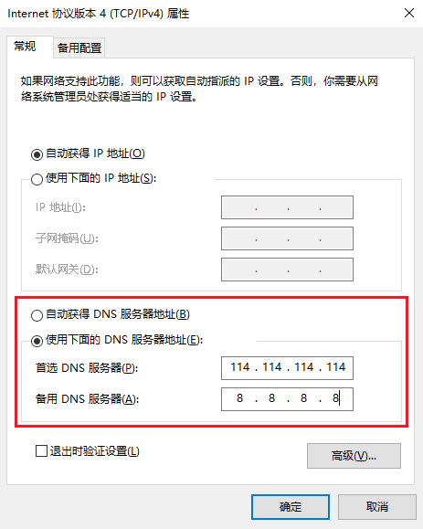

- 提示解压问题 
  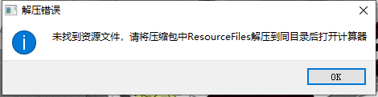

!> 请勿直接在 zip 内打开 exe 执行程序或只解压 exe 程序，exe 程序需要与 ResourceFiles 在同级目录下 

- 软件打开报错，可在 https://wwx.lanzoui.com/b01bwta9i 下载系统补丁解决 

  - failed to execute script
  - 计算机中丢失 api-ms-win-crt-runtime-l1-1-0.dll

- Failed to execute script pyi_rth_certifi 可按照以下方式解决 

  - 百度 openssl.light 安装
  - 安装https://chocolatey.org/install，然后执行命令choco install openssl.light

## 设置

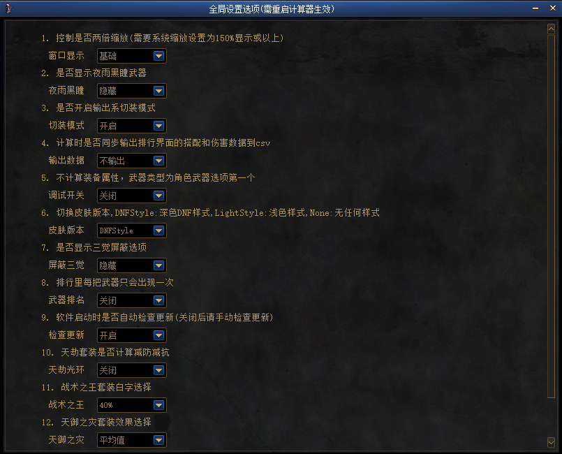

该窗口下，用户可以对计算器的部分功能进行个性化设置，常见的有：开关输出系切装、控制窗口缩放、切换计算器皮肤、停启用自动更新、控制三觉屏蔽选项等 

设置选项修改后，需要重启计算器才能生效 

## 装备/选择/打造

该页面下可选择自身以有的装备、称号、宠物，同时选择装备触发、选择特色装备的择优等 

### 一键修正

在玩家选择完所穿戴装备，初步调整打造情况(增幅、时装、宠物)后，可使用一件修正面板细节功能，输入角色站街力智、三攻、属强修正角色面板数据 

!> 该功能仅在选择单套装备的情况下生效 
如玩家穿戴了部分影响站街属性的辟邪玉(属强、加成影响站街数据技能的等级等) 
或影响站街属性的白金、时装上衣等级等，需在[辟邪玉/希洛克/黑鸦/奥兹玛]、[基础/细节/修正]进行修正 

### 装备触发

部分装备及伤害词条存在不同的触发情况，需要玩家在计算前选择对应的属性 
如手搓、777、军神等各种会触发不同属性的装备，不同的选择下会对应不同的计算结果 
较为特殊的是，`持续伤害词条`也需要调整对应的计算比例，默认为 100%，计算器目前无法做到技能队列排列，需自行预估适用比例(影响范围较小) 

### 计算模式

出于计算时间考虑，计算器设置了三种后台计算模式 

- 急速模式：计算 533 搭配、3332(散搭)搭配，智慧产物相关防具、首饰、特殊不纳入计算
- 套装模式：计算 533 搭配、3332(散搭)搭配、3332(防具 3+2)搭配，智慧产物相关防具、首饰、特殊不纳入计算
- 单件模式：计算所有组合，不包含百变怪

注：选项中的组合数为预估值，不代表实际计算组合 
计算占用进程数默认为电脑 CPU 的逻辑核心数，选择最大值时速度最快，但是 CPU 占用会达到 100%(计算时会造成游戏卡顿)，为了避免影响电脑性能，可适当降低计算器占用核心数 

计算速度参考值(CPU 为 AMD Ryzen 7 3700X ，16 进程，芙蕾雅)： 

- 急速模式(预估 9.79 万组合)：总计耗时 5.79s
- 套装模式(预估 90.43 万组合)：总计耗时 1min2.46s
- 单件模式(预估 46.35 万亿组合)：太烧 CPU，不建议这么玩

### 多配置模式

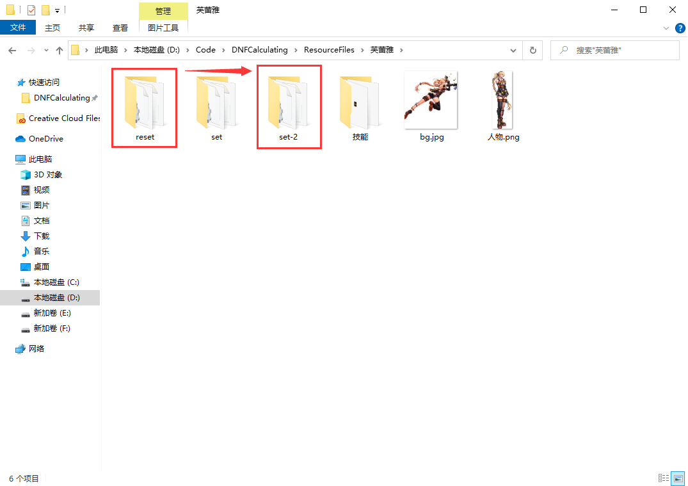

如果存在同职业多个配置(账号)的情况，可在 ResourceFiles 对应的职业文件夹下，复制 reset 文件夹后，粘贴后重命名为 set 开头的文件夹，重新选择计算器职业后即可切换配置 

!> 如出现计算结果较为离谱或出现无法使用的情况，可尝全局重置，重置所有的配置 

## 技能/符文/其他

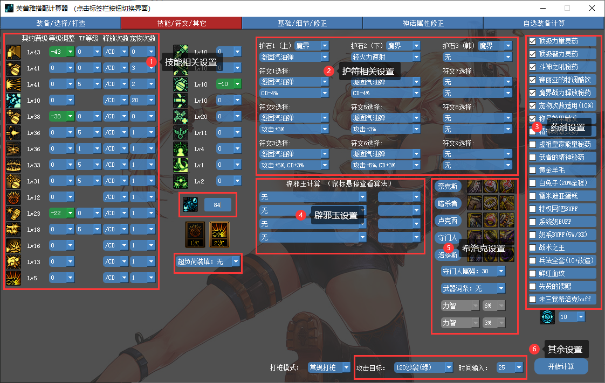

该页面下可设置计算技能相关、药剂、护符等 

### 技能相关设置

各职业已预设模板，如与自身有所出入，可以自行调整参数，具体可设置以下参数 

- 技能等级调整：技能等级默认契约满级，等级调整视个人加点情况而定，调整数值基于契约满级进行+/-调整 

!> 装备、时装上衣、白金、附魔等对技能等级的加成无需在此调整，时装下装的等级调整可在此调整 

- TP 等级：TP 基础等级为 0 级，调整数值基于契约 0 级进行+/-调整 
- 技能释放次数：技能释放次数分为/CD 与固定次数，/CD 较多职业并未考虑技能演出时间(少部分职业入芙蕾雅等做过特殊修正)，如需贴合自身修炼场技能次数，可自行调整技能次数 

!> 固定次数后会影响部分 CDR 装备的最终结果

- 宠物次数：宠物技能对技能能够加成多少次
- 技能形态选择：部分技能存在不同形态，对这些技能计算器采用下拉/勾选的形式提供选择
- BUFF 换装数值：BUFF 图标旁的输入框内可设置 BUFF 数值，默认完美换装数值
- 远古记忆/红阵：右下角可设置计算是否适用于远古或红阵，默认适用，可自行调整

### 护符设置

各职业已预设护符及符文的选择，护符版本进行切换，如与自身有所出入，可以自行调整。 

### 药剂等设置

药剂设置包含修炼场常见的药剂，同时还设置了称号触发、白兔子选项、队友光环、系统奶等一系列选项供模拟不同情况下的装备计算 

### 其余设置

计算器预设了 120、130 沙袋、0 防强化机供模拟，如需模拟其他怪物，可在`ResourceFiles\Config\攻击目标.ini`中自行修改 

## 基础/细节/修正

 

该页面下可设置附魔、白金、时装、徽章、勋章、宠物装备等细节方面的数据 

!> 如在装备/选择/打造页面勾选了光环词条择优、宠物装备择优，则对应的部位的词条选择将被禁用无法选择 

## 神话/改造属性修正

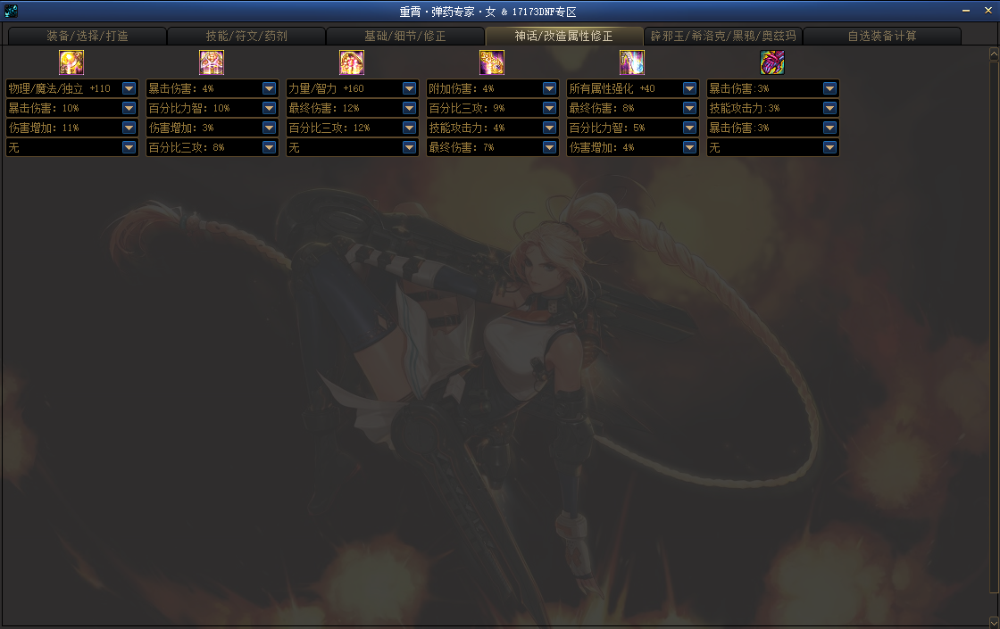 

由于游戏内神话词条数值、改造装备升级数值存在随机性，计算器提供了调整神话词条数值及改造升级属性的界面以保证计算的准确性 

!> 改造升级属性调整需在[辟邪玉/希洛克/黑鸦]中勾选智慧产物升级才会显示 

## 辟邪玉/希洛克/黑鸦/奥兹玛

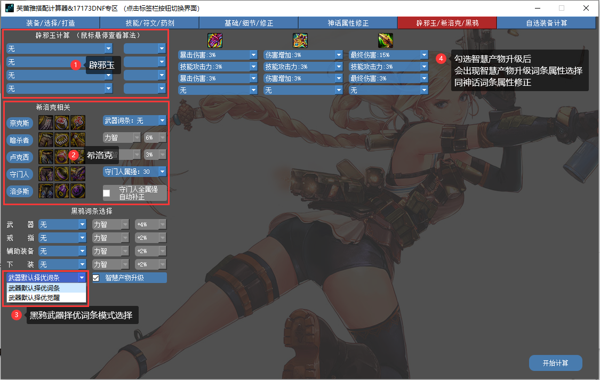 

该页面下可设置计算相关的辟邪玉、希洛克装备、黑鸦、奥兹玛装备等 

### 辟邪玉

可根据自身情况选择对应的辟邪玉属性，鼠标悬停至文字上方可查看辟邪玉的算法 

!> 属白增幅分对应属性，计算器未作区分，双属性附加(星之海)需手动计算并在第三页修正 

### 希洛克

可根据自身情况选择对应的残香融合及装备融合，残香选择自适应最高值会自动计算最优解，结果显示在详情界面 

守门人全属强自动补正：自带单属强职业不可使用，在计算时自动替换细节页的附魔勋章为<strong>毕业</strong>的全属强方案，细节页面对应的附魔设置会失效，如需调整，可在进图/站街修正做对应的属强加减 

### 黑鸦

可根据自身情况选择对应的黑鸦遴选词条，选择计算最高会自动计算最优解，结果显示在详情界面 

!> 计算最优解时，百分比力智词条较为特殊，与力智数值有关，在无奶/系统奶时，受到力智影响，没有实际数值显示的提升 

由于除武器外，不同装备的遴选最终显示数值存在差异，自选范围计算器提供的选项为相对值：2%、4%、6%、8%（武器为：4%、8%、12%、16%），计算器选择数值 = 装备最终遴选数值 - 装备遴选最小值 + 2% 

此外，为了减少计算量，黑鸦武器词条择优提供了词条择优及觉醒词条择优的选项，用户可针对自身情况选择 

### 奥兹玛

可根据自身情况选择对应的奥兹玛装备，阿斯特罗斯暂不支持分时间段加成技能，需自行选择对应的技能加成区间，几件装备选择几个区间 

## 自选装备计算

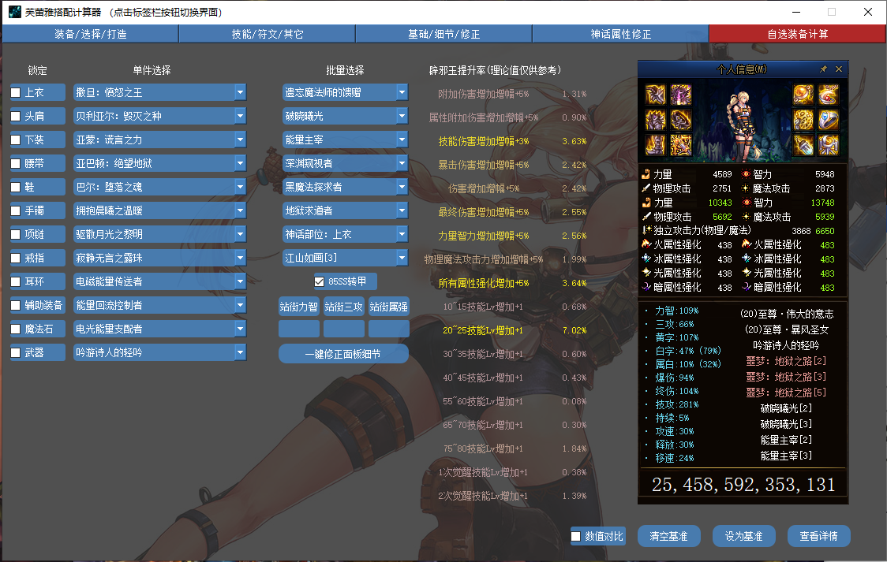

自选装备计算界面，可供用户快捷的进行单套装备的选择和预估 
在选择完单套装备后，可将其设置为基准值，之后的排行/计算等将以基准值为参考进行各技能及总伤害等的对比以供参考 
同时提供了辟邪玉的<strong>单个词条</strong>的理论提升 

!> 部分等级加成的词条可能会造成技能 CD 的缩减，导致提升偏高

## 装备排行界面

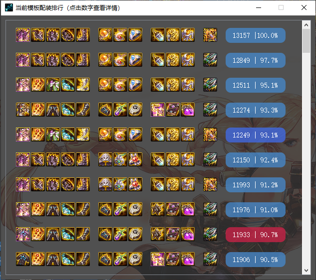

点击开始计算后会对选择装备进行排行计算，按钮 | 左边为预估的伤害数字，| 右边为相较于第一套装备的强度，点击按钮可查看详细的数据情况 
如当前搭配存在技能等级溢出的情况，按钮颜色会显示为红色以作提示，鼠标移动到按钮上会告知溢出技能详情 

## 详细数据界面

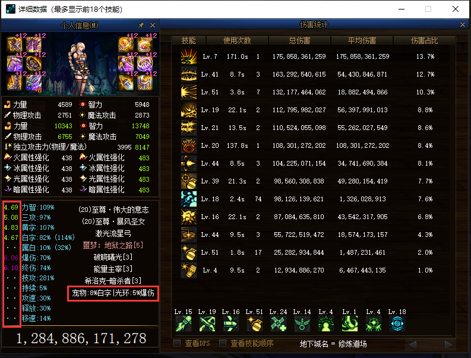

详情界面详细展示某个搭配下人物属性、技能伤害等，如选择了宠物装备|光环择优，会在套装情况下展示择优选择供参考 

右下角提供了输出所有的择优项搭配及相对最优解的差值方便用户自行选择，以及输出技能倍率数据功能方便对比技能秒伤等 

## 奶系

### 择优方向选择

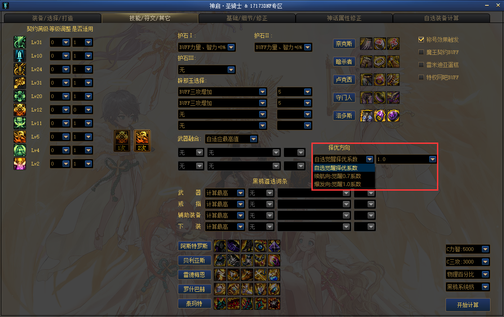由于奶在不同的副本存在择优偏差，计算器对于单套的择优，提供了续航向、爆发向、及自定义太阳系数的方式作为最优解的计算方向，用户在使用时，可针对自身情况选择合适的选项 

### 光环、宠物、称号等补正

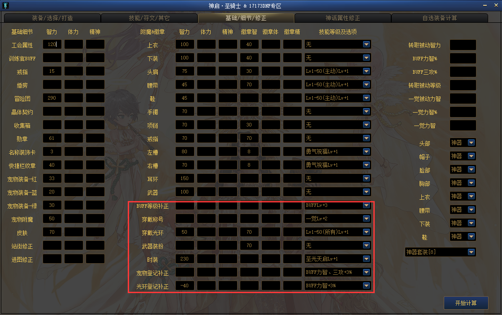

针对奶的时装、光环、宠物、称号登记和穿戴不同，计算器在[基础/细节/修正]页面提供了对应的修正等级、词条及适用的选项，宠物、光环等级加成被动差异造成的适用不同暂时需要在此进行手动修正 

### 双切计算

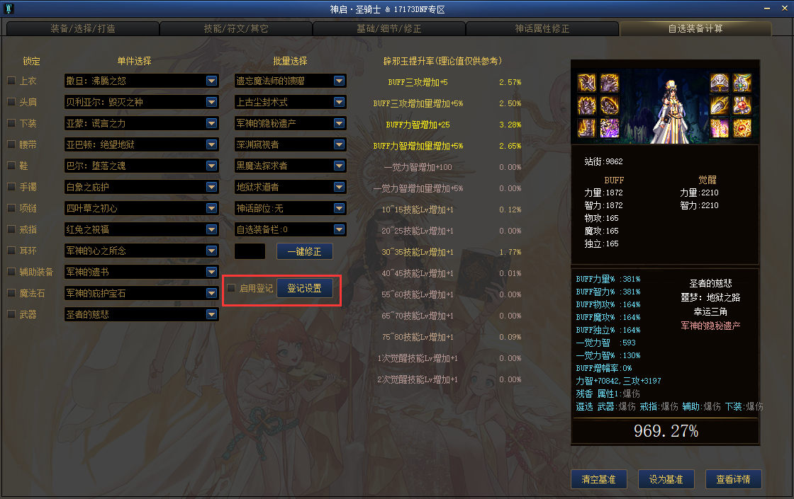

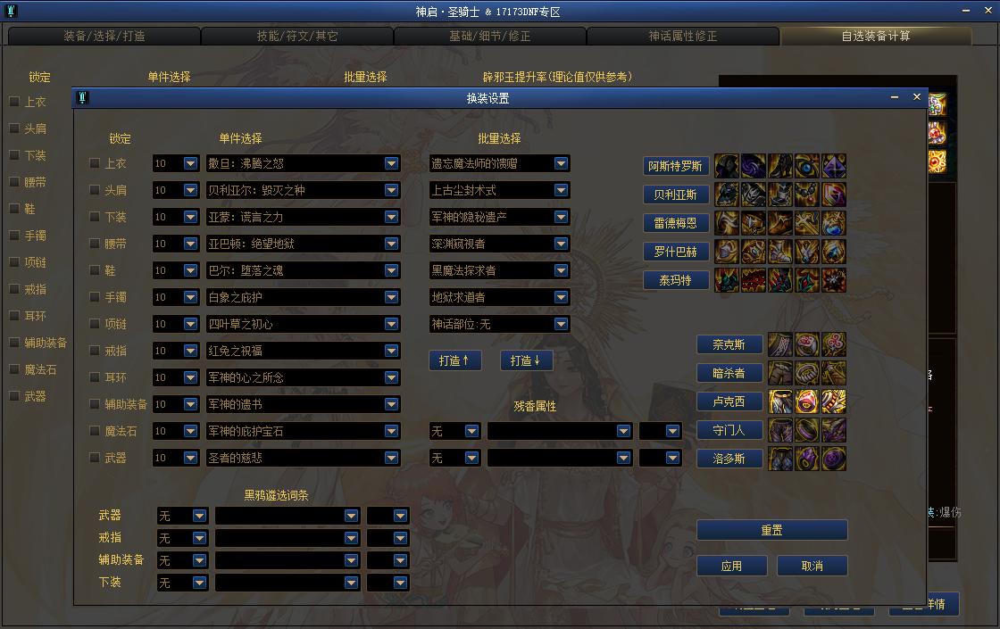

部分用户存在双切需求，在[自选装备计算]中勾选启用登记，并在登记设置中设置对应的双切，登记设置中为 BUFF 套，自选装备为太阳套，双切只适用于自选装备计算 

## 补充

### 输出系切装

如存在需要切换武器/装备的情况，可在选择职业页面点击打开设置，开启对应功能 
重启后，在自选装备计算的装备后及技能/符文/其他的技能后面会出现勾选选项，对需要切换的装备及技能进行勾选即可 

### BUG 反馈等

提供了 QQ 群及 Gitee 反馈途径，推荐在 Gitee 上按照要求建立 issue 进行反馈，Gitee 会优先处理，群不常看 
Gitee 反馈地址：https://gitee.com/i_melon/DNFCalculating/issues?state=all 
